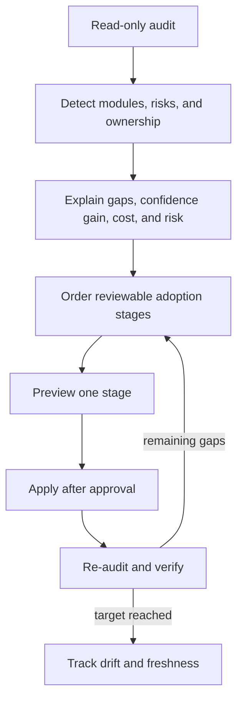
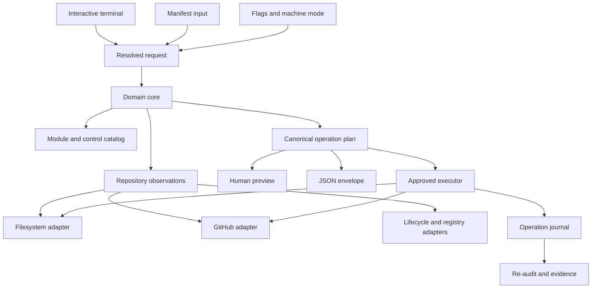
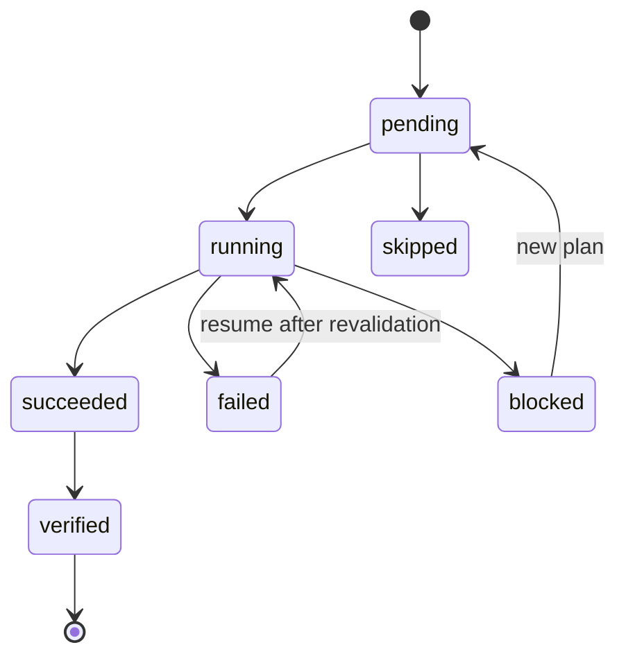

# Threadlabs Project Framework - Plan

## Goal Capsule

- **Objective:** Maintainers can start or align an open-source repository with current, defensible engineering practices, understand the confidence and time cost of every control, and give coding agents an evidence-based definition of done.
- **Means:** The `threadlabs` CLI and package implement the versioned standard through a functional core, composable modules, optional bundles, repository auditing, immutable operation plans, staged adoption, safe upgrades, and reusable verification and release controls (KTD1-KTD6).
- **Product authority:** This plan owns the public product behavior and standards contract. Private research and organization-specific project management remain outside the product.
- **Execution profile:** Build and verify the complete first local release in this repository. Publishing, repository visibility changes, and migrations of other repositories remain separate decisions.
- **Stop conditions:** Stop rather than overwrite ambiguous ownership, apply a stale plan, escape the target root, publish directly from the local CLI, or mutate remote state without a distinct digest-bound approval.
- **Tail ownership:** Local implementation and verification are in scope. Commit, push, publication, and public visibility are not authorized by this plan.
- **Open blockers:** None.

---

## Product Contract

### Summary

Threadlabs will make a reasoned project standard executable for both new and existing repositories. It will recommend only controls with a stated risk model and verification cost, then help maintainers adopt and update those controls without erasing intentional local choices.

The implementation covers the full local lifecycle and uses a pure planning engine behind terminal, config, and machine interfaces. Remote GitHub settings and generated release automation remain separately approved effects. Tests use synthetic repositories plus this repository; private audit inputs never enter the product.

**Product Contract preservation:** Extended with R43-R50 and AE11-AE16 to clarify safety, recovery, and machine-interface behavior already required by R7-R12, R19, R31-R33, and R41-R42. R1-R42 and their scope are unchanged.

### Problem Frame

Project setup tends to accumulate through copying and incident response. Over time, maintained tooling, CI coverage, release safety, repository settings, and agent guidance drift independently. A maintainer can see that repositories differ without being able to tell which differences are requirements and which are unfinished infrastructure.

A static template solves only project creation. A maximal template imports expensive machinery without proving that its failure model transfers. A minimal template makes adoption easy but leaves maintainers and coding agents unable to distinguish a plausible result from a verified one.

The missing product is a versioned decision system. It must explain which controls apply, what each proves, how much time it consumes, and how an existing repository can move toward the standard through small, reviewable changes.

### Key Decisions

- **Optimize confidence per unit of verification time.** (session-settled: user-approved — chosen over adopting the strongest observed practices wholesale: expensive controls must earn their place through a transferable failure model.) Governs R4, R13-R19.
- **Compose controls from modules and detected risks.** (session-settled: user-approved — chosen over monolithic profiles and strictness tiers based on project size or maturity: missing investment must not be mistaken for a legitimate low-rigor setup.) Governs R2-R6, R37-R42.
- **Make the standard executable for new and existing repositories.** (session-settled: user-approved — chosen over a static starter template: adoption difficulty and ongoing drift are part of the product problem.) Governs R7-R12.
- **Use one config through every setup experience.** (session-settled: user-approved — chosen over separate interactive and automation workflows: the terminal UI, config-first path, and non-interactive path must converge on the same manifest.) Governs R3, R7, R40-R42.
- **Use maintained LTS runtimes and maintained stable tooling.** (session-settled: user-directed — chosen over preserving repository-specific version drift: version variation is intentional only when a compatibility contract explains it.) Governs R20-R25.
- **Budget verification by lane.** (session-settled: user-approved — chosen over running every available check on every edit: fast feedback and deep evidence have different execution windows.) Governs R13-R18.
- **Keep the public product independent of private research.** (session-settled: user-directed — chosen over publishing source-project comparisons: the framework must stand on general reasoning, synthetic examples, public authorities, and its own measured behavior.) Governs R1, R40.

### Actors

- A1. **Maintainer:** creates projects, reviews recommendations, chooses modules, approves mutations, and owns exceptions.
- A2. **Coding agent:** reads the project contract, runs the applicable verification lane, and reports bounded evidence rather than an unqualified completion claim.
- A3. **Contributor:** works within generated repository conventions without needing Threadlabs-specific background.
- A4. **External systems:** source hosts, CI runners, package registries, dependency services, and runtime/tool maintainers provide state the framework audits or acts upon.

### Requirements

**Policy model and public boundary**

- R1. Every committed artifact, example, fixture, rationale, and generated output must be safe to publish without exposing private project identities, paths, incidents, or recognizable project-specific rules.
- R2. The standard must have a versioned universal baseline plus composable modules selected by observable project needs, while optional bundles may preselect modules without becoming separate standards.
- R3. Each managed repository must declare its selected modules, standard version, intentional exceptions, and locally owned files or sections in a machine-readable manifest.
- R4. Every control must declare the failure class it addresses, applicability trigger, expected execution lane, determinism, cost budget, cheaper alternatives considered, and retirement or demotion condition.
- R5. A module may add controls only when its risk model differs from the baseline or it expands a compatibility promise.
- R6. An exception must record its reason, owner, scope, and review date without making the entire repository non-conformant.

**Starter, audit, and adoption**

- R7. A maintainer must be able to initialize a new supported repository from selected modules or a bundle and review the complete proposed change before files are written.
- R8. A maintainer must be able to audit an existing repository without writes and receive applicable module suggestions, confirmed gaps, intentional exceptions, unsupported areas, and unknowns.
- R9. Each audit recommendation must report expected confidence gain, estimated CI-time change, migration risk, human effort, and the evidence behind the recommendation.
- R10. Existing-repository adoption must be staged into independently reviewable changes ordered by safety and prerequisite relationships.
- R11. Applying a stage must be previewable, idempotent, and non-destructive, while preserving declared local ownership and refusing ambiguous overwrites.
- R12. Upgrading the standard must produce a migration preview, distinguish policy changes from version refreshes, and re-audit after application.

**Verification economics**

- R13. The inner-loop lane must target 90 seconds or less and run changed-scope static checks, focused tests, and the build steps needed to make those results truthful.
- R14. The required pull-request lane must target five minutes or less and contain deterministic correctness, build, package, and supported-runtime evidence needed to protect the default branch.
- R15. The extended lane must target 15 minutes or less and run only when change scope or selected modules justify broader platform, corpus, coverage, integration, or calibrated performance evidence.
- R16. Scheduled and release lanes must own long-running, noisy, exhaustive, and publication-specific checks that would slow ordinary development without increasing every pull request's confidence proportionally.
- R17. Runtime matrices must test every maintained line promised to users, while cross-platform legs must exist only for platform-sensitive products or behavior.
- R18. The framework must ingest observed CI durations when available, compare them with lane budgets, and identify duplicated, noisy, or misplaced controls without silently deleting them.
- R19. A coding agent may claim only the verification level it ran and must report the revision, commands or named checks, results, skipped applicable controls, and remaining human judgment.

The lane contract is a control-placement rule, not a four-level quality score:

| Lane | Target wall time | Primary evidence | Covers |
| --- | ---: | --- | --- |
| Inner loop | 90 seconds | Fast feedback on the active change | R13 |
| Required pull request | 5 minutes | Deterministic merge confidence | R14 |
| Extended | 15 minutes | Risk-triggered breadth | R15 |
| Scheduled or release | Report actual duration | Exhaustive, noisy, or publication evidence | R16 |

**Technology and freshness**

- R20. Runtime modules must resolve current support status from the runtime's published lifecycle, use an Active LTS line for development, and remove EOL lines unless an explicit compatibility exception retains them.
- R21. Tooling must use maintained stable releases, be pinned reproducibly, and require a reason plus review date for prerelease, EOL, or intentionally held versions.
- R22. The initial TypeScript library bundle must select pnpm, ESM TypeScript with strict checking, Vitest, Oxlint, and unbundled TypeScript output unless a distribution requirement earns a bundler.
- R23. Node type definitions must align with the oldest supported runtime so static checking cannot silently permit unavailable runtime APIs.
- R24. Dependency automation must group routine patch and minor updates weekly, surface major updates for deliberate monthly review, and prioritize security updates immediately according to severity.
- R25. Freshness reporting must distinguish current, update available, security-blocked, EOL, prerelease, intentionally held, and update-failed states without collapsing them into a score.

**GitHub, CI, and collaboration**

- R26. GitHub repositories must default to `main` and use `<type>/<short-kebab-description>` branches with the standard types `feat`, `fix`, `refactor`, `perf`, `docs`, `test`, `chore`, `release`, and `experiment`.
- R27. The default branch must block deletion, force pushes, and direct changes while requiring a stable aggregate check and resolved review conversations; approval count may be zero for a solo-maintainer setting and at least one for collaborative maintenance.
- R28. Merge commits must remain available for reviewed multi-commit work, squash must remain available for disposable or automated branch history, rebase merging must be disabled, and merged branches must be deleted automatically.
- R29. Workflows must declare least-privilege permissions, cancel superseded non-release work where safe, use frozen dependency installs, and expose stable required-check names even when expensive work is conditionally skipped.
- R30. External actions must be pinned to full commit SHAs with readable release comments and automated update coverage.

**Publishing and supply chain**

- R31. A published package must pass a clean build, package-content inspection, install or packed-consumer smoke test, version and changelog integrity checks, and a non-mutating release dry run before publication.
- R32. Standard npm publication must use trusted OIDC publishing from a protected GitHub workflow, avoid long-lived automation tokens, and create traceable tags and releases from the reviewed release state.
- R33. Release automation must be resumable after partial registry or release failure and must never republish or overwrite an immutable version.
- R34. Release modules must support single-package, fixed-version monorepo, independent-version monorepo, prerelease-channel, and documented exceptional multi-artifact flows without making their machinery universal.

**Agent guidance and durable learning**

- R35. Each managed repository must have a concise root `AGENTS.md` as the cross-tool front door, with load-bearing rules owned there or in linked canonical documents rather than only in vendor-specific configuration.
- R36. Agent guidance must identify authoritative requirements, safe and destructive operations, applicable verification commands, generated-artifact hazards, completion evidence, and the route for unresolved owner decisions.
- R37. Tool-specific adapters and scoped guidance may route agents to canonical rules but must not create competing sources of truth.
- R38. A repeated or expensive escaped defect must graduate from prose into a regression test, deterministic check, or narrowly scoped reusable skill when that mechanism can decide the failure reliably.
- R39. Transient plans, branch state, measurements, and handoff notes must remain outside stable agent instructions unless they define a durable contract.

**Public module system and setup experience**

- R40. The first public release must provide modules for core repository policy, TypeScript and Node, GitHub, npm publishing, dependency freshness, agent guidance, public APIs, generated artifacts, documentation sites, cross-platform behavior, browser behavior, performance sensitivity, and long-running work.
- R41. Interactive terminal setup, config-first setup, and non-interactive flags must read and write the same manifest, produce the same plan, and differ only in how selections are supplied.
- R42. The framework must expose a versioned extension contract for future ecosystems, while local generation, audit, verification, and adoption remain useful without GitHub and remote settings automation may be GitHub-only in the first release.

**Safe execution and machine contracts**

- R43. Every terminal, config-first, and flag-driven action must resolve through the same domain operation, while terminal prompts remain an input and confirmation adapter with no unique policy or mutation logic.
- R44. Every command must support a versioned machine-readable envelope with stable control identifiers, deterministic ordering, documented exit classes, structured stdout, and separate diagnostics.
- R45. Every mutation must apply an immutable operation plan bound to the canonical manifest, standard version, repository fingerprint, selected stage, expected local preimages, and observed remote state; any relevant drift requires a new plan.
- R46. Multi-stage application must journal pending, running, succeeded, failed, blocked, and skipped effects, revalidate postconditions before resume, and avoid duplicating immutable or remote actions.
- R47. Managed writes must remain inside the physical target root, reject absolute and parent-traversal targets, protect `.git`, and refuse managed-path symlink traversal or case-collision ambiguity.
- R48. Local and remote mutations require separate, digest-bound approvals, while authentication consent, secret entry, visibility changes, ambiguous overwrites, and final publication approval remain human-only.
- R49. External evidence must record source, observation time, normalized state, and freshness; unavailable, forbidden, rate-limited, stale, or invalid evidence must remain unknown and cannot authorize remote mutation.
- R50. The local CLI may generate, audit, and dry-run release automation but must not publish packages directly; a reviewed protected workflow owns trusted publication and verifies immutable registry state before retrying a partial release.

### Key Flows

- F1. **Start a new repository**
  - **Trigger:** A maintainer selects modules directly or starts from an optional bundle.
  - **Actors:** A1, A4
  - **Steps:** An interactive terminal selector, checked-in config, or non-interactive flags produce the same manifest; the framework resolves maintained versions, explains selected controls and estimated lane costs, previews generated artifacts and settings, then applies only after confirmation.
  - **Outcome:** The repository reaches its first truthful green baseline without later template detachment.
  - **Covers:** R2-R7, R13-R17, R20-R30, R35-R49.

- F2. **Adopt the standard in an existing repository**
  - **Trigger:** A maintainer runs a read-only audit.
  - **Actors:** A1, A4
  - **Steps:** The framework detects applicable modules, risks, and local ownership, classifies findings, estimates benefit and cost, proposes ordered stages, previews one stage, applies it safely, and re-audits.
  - **Outcome:** Adoption advances through reviewable evidence instead of an all-or-nothing rewrite.
  - **Covers:** R3-R12, R18, R25, R43-R49.

- F3. **Complete an agent-driven change**
  - **Trigger:** A coding agent receives a repository task.
  - **Actors:** A1, A2
  - **Steps:** The agent reads canonical guidance, selects the lane required by the changed surfaces, runs it, and returns bounded evidence plus any remaining manual judgment.
  - **Outcome:** “Done” names a reproducible evidence level rather than agent confidence.
  - **Covers:** R13-R19, R35-R39, R43-R44.

- F4. **Refresh project dependencies and tooling**
  - **Trigger:** A scheduled update or lifecycle change is detected.
  - **Actors:** A1, A4
  - **Steps:** Routine compatible updates arrive in grouped changes, security work is prioritized, major changes are queued for review, and the applicable verification lanes decide acceptance.
  - **Outcome:** Projects stay current without constant bot noise or unreviewed breakage.
  - **Covers:** R20-R25, R30, R43-R44, R49.

- F5. **Publish a package**
  - **Trigger:** A reviewed release state is approved for publication.
  - **Actors:** A1, A4
  - **Steps:** Release checks prove package contents and consumer behavior, trusted publishing authenticates the workflow, immutable artifacts are published, and registry plus source-host state is verified or safely resumed.
  - **Outcome:** The published artifact is traceable to the reviewed source state and does not depend on a reusable secret.
  - **Covers:** R31-R34, R44, R46, R48-R50.



### Acceptance Examples

- AE1. **Covers R5, R13-R18.** Given a small library with no platform-sensitive code, when its selected modules are applied, then it receives deterministic library checks but no cross-OS or performance matrix without a module trigger.
- AE2. **Covers R8-R11.** Given an existing repository with custom workflows, when adoption is requested, then the framework reports ownership ambiguity and previews an additive stage instead of overwriting the workflows.
- AE3. **Covers R9, R18.** Given a pull-request check whose measured duration exceeds its lane budget, when audited, then the finding identifies its confidence contribution and offers evidence-based placement alternatives rather than deleting it automatically.
- AE4. **Covers R17, R20, R23.** Given a TypeScript library that promises two maintained LTS lines and still tests an EOL line, when audited, then the maintained lines remain, the EOL leg is flagged, and type definitions are checked against the minimum supported line.
- AE5. **Covers R19, R35-R37.** Given an agent that ran focused tests but skipped an applicable packed-consumer check, when it reports completion, then the report states partial verification and names the missing evidence.
- AE6. **Covers R24-R25, R30.** Given routine dependency and action updates, when the weekly freshness run executes, then compatible updates are grouped while major and security updates retain distinct urgency and review treatment.
- AE7. **Covers R31-R34.** Given a registry timeout after one artifact publishes, when the release is resumed, then the workflow verifies the immutable published artifact and continues without attempting to overwrite it.
- AE8. **Covers R38.** Given the same costly defect class escapes twice and a deterministic reproduction exists, when the standard is updated, then the lesson becomes an executable check or scoped skill rather than another advisory paragraph.
- AE9. **Covers R1, R40.** Given the repository and its fixtures are published, when inspected, then no private project name, local path, private incident, or copied project-specific rule appears.
- AE10. **Covers R3, R7, R41.** Given the same module selections through the terminal UI, a checked-in config, and non-interactive flags, when each path generates a plan, then the resulting manifest and managed repository state are equivalent.
- AE11. **Covers R11, R45.** Given an approved plan and a changed managed preimage or manifest, when application starts, then the CLI rejects the stale plan and requires a new preview instead of accepting an acknowledgement against the old digest.
- AE12. **Covers R11, R46.** Given interruption after local effects succeed and before remote effects begin, when the operation resumes, then completed postconditions are revalidated and no completed effect is repeated.
- AE13. **Covers R11, R47.** Given a managed path that traverses a symlink outside the target root, when planning or application runs, then the operation is blocked before any write.
- AE14. **Covers R8, R42, R48-R49.** Given missing or insufficient GitHub credentials, when remote audit or application is requested, then local work remains usable and the remote result is reported as unknown or blocked without implying compliance.
- AE15. **Covers R41, R43-R44.** Given equivalent terminal, config, and flag selections, when they resolve, then they produce the same canonical manifest and plan digest, and machine mode emits no prompt or decoration on stdout.
- AE16. **Covers R19, R44.** Given a canceled or partially unavailable verification lane, when evidence is emitted, then canceled, skipped, failed, and unknown checks remain distinct and the report cannot claim the stronger lane passed.

### Success Criteria

- **Covers R7.** A new supported repository can reach a previewed, first-green baseline in no more than 15 minutes of maintainer interaction, excluding dependency download, CI queue, and runner execution time.
- **Covers R8-R12.** An existing repository receives a useful read-only adoption report before any authorization to write or change remote settings is requested.
- **Covers R4, R9.** Every recommendation exposes rationale, confidence gain, cost, effort, and risk in language a maintainer can challenge.
- **Covers R6, R13-R18.** Generated and migrated repositories stay within the lane budgets or carry a visible exception backed by observed duration and value.
- **Covers R11-R12.** Reapplying the same standard version to a conforming repository produces no changes.
- **Covers R19, R35-R37.** A coding agent can identify authoritative instructions and applicable verification without relying on prior conversation.
- **Covers R1, R40.** Public-source scanning and synthetic-fixture review find no private project identifiers or private provenance.
- **Covers R20-R25.** Freshness automation prevents managed projects from silently retaining EOL runtimes or unreviewed prerelease tooling.

### Scope Boundaries

**Included in the first public release**

- A public standard and machine-readable manifest.
- Starter, audit, staged adoption, upgrade, and verification experiences.
- The public modules and optional TypeScript library bundle named in R40.
- GitHub repository and Actions auditing, with explicit opt-in application of remote settings.
- npm package-release requirements, local dry-run support, and generated trusted-publishing workflows.
- Human-readable and machine-readable evidence reports for maintainers and coding agents.

**Deferred for later**

- A hosted dashboard, GitHub App, or continuously running management service.
- Remote-settings automation for source hosts other than GitHub.
- First-party modules for additional language ecosystems and game engines.
- Automatic merging of dependency updates or automatic publication without an explicit release decision.
- Migrating specifically named repositories outside Threadlabs during this delivery; generic existing-repository audit, staged adoption, and upgrade behavior remain in scope and use only synthetic public fixtures.
- Direct local package publication; v1 publication executes only inside the generated protected workflow.

**Outside this product's identity**

- A universal repository score or competitive maturity ranking.
- A maximal checklist that treats every available control as mandatory.
- An autonomous bot that mutates repositories or remote settings without a preview and explicit approval.
- A private cross-repository data store, surveillance system, or public catalogue of private audit inputs.

### Dependencies / Assumptions

- The framework may use public runtime lifecycle, package registry, and GitHub metadata to resolve freshness and remote settings.
- Local behavior must remain useful when network or source-host access is unavailable; unavailable evidence is reported as unknown rather than compliant.
- Generated versions are explicit and reproducible even when the governing policy says “current maintained stable.”
- The first implementation may use a Node-based local tool, but planning must preserve the extension contract for non-Node target repositories.
- Repository visibility changes, publishing the Threadlabs repository, and migrations of existing projects require separate explicit decisions.

### Sources / Research

- [Node.js releases](https://nodejs.org/en/about/previous-releases) defines maintained runtime status and recommends Active or Maintenance LTS for production applications.
- [GitHub secure-use guidance](https://docs.github.com/en/actions/reference/security/secure-use) identifies full commit SHAs as the immutable way to pin actions and documents automated update support.
- [GitHub Dependabot version updates](https://docs.github.com/en/code-security/concepts/supply-chain-security/dependabot-version-updates) documents scheduled package and GitHub Actions updates.
- [npm trusted publishing](https://docs.npmjs.com/trusted-publishers/) documents OIDC publication and automatic provenance for eligible public packages.
- [Node.js release schedule](https://github.com/nodejs/Release#release-schedule) identifies Node 24 as Active LTS and Node 22 as Maintenance LTS on the plan date.
- [Inquirer prompts](https://www.npmjs.com/package/%40inquirer/prompts) provides the maintained checkbox-based terminal input used only by the interactive adapter.
- [Dependabot grouped updates](https://docs.github.com/en/code-security/tutorials/secure-your-dependencies/optimizing-pr-creation-version-updates) supports GitHub-native grouped compatible updates while keeping security-update treatment distinct.
- [Changesets](https://changesets.dev/guide/getting-started) supplies the optional monorepo release adapter without making its workflow part of the universal baseline.
- [GitHub reusable workflows](https://docs.github.com/en/actions/how-tos/reuse-automations/reuse-workflows) supports typed reusable workflow contracts and identifies full commit SHAs as the safest external reference.

---

## Planning Contract

### Key Technical Decisions

- KTD1. **Publish one ESM package and CLI named `threadlabs`.** The package exposes the extension contract while the `threadlabs` binary owns human and automation workflows. Use Node 24 for development, support Node `>=22.13`, and test Node 22 and 24. This applies the maintained-runtime decision in R20-R23 without preserving accidental drift. (session-settled: user-directed — chosen over repository-specific version carryover: maintained LTS lines are the default unless a compatibility contract earns an exception.)
- KTD2. **Use a functional core with effect adapters.** Domain code owns manifest resolution, module applicability, findings, operation plans, stage ordering, evidence, and policy explanations. Filesystem, process, network, GitHub, registry, terminal, and JSON behavior implement explicit ports around that core. This makes R41 and R43 structural rather than a convention.
- KTD3. **Use `threadlabs.config.json` as the sole authored manifest and `.threadlabs.lock.json` as generated state.** The manifest owns selections, exceptions, ownership grants, and policy inputs. The lock records resolved standard and module versions plus managed-artifact digests, but never introduces policy. JSON Schema files version both contracts. (session-settled: user-approved — chosen over separate interactive and automation configurations: every setup path must converge on one manifest.)
- KTD4. **Ship built-in modules through the same declarative contract used by extensions.** A module declares its applicability observations, controls, dependencies, conflicts, generated artifacts, verification checks, capabilities, and optional adoption stages. V1 third-party extensions are data and template packages interpreted by built-in hosts; they do not execute package code in the maintainer process. Bundles are named module selections only. This applies R2-R6 and R40 without hard-coding monolithic profiles. (session-settled: user-approved — chosen over one maximal profile or maturity tiers: controls compose from observable risks.)
- KTD5. **Canonicalize and hash every operation plan before mutation.** Plans bind the target root, repository fingerprint, manifest and lock digests, evidence snapshots, stage, expected preimages, local effects, remote effects, and postconditions. `apply` requires the plan file plus its digest and rejects any mismatch under R45.
- KTD6. **Use forward recovery with an append-only local operation journal.** Each run has an opaque run ID, and each effect has a deterministic ID under its plan digest. Journal events record attempt, precondition, request fingerprint, response class, and postcondition observation. Resume re-observes semantic postconditions before retrying an unknown-started effect and never assumes local and remote effects are one transaction. Local writes use sibling temporary files and atomic rename; recorded preimages permit rollback only for framework-created or unchanged managed files. Journals and preimages live in ignored `.threadlabs/operations/`; explicit export creates a redacted evidence artifact.
- KTD7. **Manage whole files by default and named regions only when a module defines stable anchors.** Each artifact is `managed`, `section-managed`, `local`, `unmanaged`, or `ambiguous`. The lock stores last-applied digests and anchor identities. Drift in an owned region blocks application until a new ownership decision is written to the manifest.
- KTD8. **Make the versioned JSON envelope the automation contract.** Human renderers consume the same result objects. Structured stdout contains one deterministic envelope; progress and diagnostics use stderr. Exit classes distinguish success, findings, invalid input, stale plan or conflict, unavailable evidence, cancellation, and failed mutation.
- KTD9. **Use `@inquirer/prompts` only in the terminal adapter.** The interactive selector gathers module and bundle choices, shows plans, and requests approvals. Keyboard-only operation, textual state changes, sequential dependency and cost summaries, cancellation, and a noninteractive equivalent are required. `node:util.parseArgs`, manifest input, and prompts all produce the same validated resolved request. No command requires a TTY.
- KTD10. **Use a `gh`-backed GitHub adapter for v1 remote operations.** Read-only audit remains optional and local work survives absent credentials. The adapter uses host-managed `gh` authentication or an explicitly injected ephemeral secret, never accepts credentials in manifests, plans, arguments, journals, or evidence, and documents the minimum scope plus host-owned revocation and rotation. Remote application consumes a separately approved remote plan, checks authenticated identity, permissions, repository identity, and observed settings again, then calls `gh api` without a shell.
- KTD11. **Use public lifecycle and registry adapters with source-level cache semantics.** Node lifecycle data and npm metadata are normalized into timestamped observations. A 24-hour cache may inform a recommendation, but stale or unavailable evidence cannot authorize a version-changing or remote stage.
- KTD12. **Generate GitHub-native dependency and release automation.** Dependabot is the default freshness adapter because the first release is GitHub-first and its grouped update model satisfies R24 at low installation cost. Changesets is optional for monorepo release modes. The local CLI performs package inspection and dry-run checks; the protected generated workflow owns npm OIDC publication under R50.
- KTD13. **Vendor self-contained workflows in v1.** Generated repositories receive thin local workflows and full-SHA action pins so their required checks do not depend on Threadlabs availability. Centrally reusable workflows remain a later contract addition after they have a real consumer; Dependabot owns action revision updates in v1.
- KTD14. **Use exact tool pins with pnpm, TypeScript, Vitest, Oxlint, and Prettier.** Initial implementation resolves pnpm 11.25.0, TypeScript 7.0.2, Vitest 5.0.0, Oxlint 1.81.0, Prettier 3.9.6, `@types/node` 22.20.1, and `@inquirer/prompts` 8.7.1. The minimum Node and type-definition lines match, and future updates follow R20-R25 rather than retaining these versions indefinitely.
- KTD15. **Version public contracts independently and deprecate before removal.** Supported manifest, lock, plan, and evidence schema majors remain backward compatible; control and module IDs are never repurposed. CLI removals and schema-major changes require a documented migration and at least one released deprecation cycle. The declarative third-party extension surface is experimental in the first release and is labeled separately from stable built-in contracts.

### High-Level Technical Design

The public API and every user interface share one domain pipeline. Adapters may supply observations or execute approved effects, but they cannot decide policy.



Mutation is a two-phase protocol. Planning has no effects. Application consumes the exact reviewed artifact and stops on changed inputs.

```mermaid
sequenceDiagram
  participant U as Maintainer or agent
  participant C as CLI
  participant P as Planning core
  participant A as Effect adapters
  U->>C: audit or plan
  C->>P: resolved request plus observations
  P-->>U: immutable plan plus digest
  U->>C: apply plan plus digest and scope approval
  C->>P: revalidate snapshot and preimages
  alt stale or ambiguous
    P-->>U: blocked result; re-plan required
  else valid
    C->>A: execute journaled local effects
    opt separately approved remote scope
      C->>A: execute observed GitHub effects
    end
    C->>P: re-audit postconditions
    P-->>U: bounded evidence
  end
```

The journal records effect state rather than pretending the filesystem and GitHub form one transaction.



### Assumptions

- The first release uses JSON for authored configuration. YAML and executable config can be added later through a parser adapter without changing the domain schema.
- The repository root may itself resolve through a symlink. Managed child paths may not traverse symlinks in v1.
- `gh` is an optional external capability for GitHub evidence and mutation. Its absence is an explicit unsupported or unknown state, not an installation side effect.
- Local journals remain ignored until the maintainer explicitly exports redacted evidence. A `clean` command may remove completed journals after their postconditions are verified.
- The first release generates and verifies publishing workflows but does not invoke `npm publish` from the local process.
- Built-in module content is versioned with the package. Third-party module loading accepts only explicit declarative packages from the manifest, and v1 does not import executable extension code.

### Implementation Constraints

- Never invoke repository commands through a shell. Pass argument arrays to child processes and capture bounded output.
- Normalize all emitted paths relative to the target root. Redact tokens, environment values, home-directory prefixes, and raw remote output before evidence export.
- Keep source adapters injectable so unit and integration tests do not require network access, GitHub credentials, or the real npm registry.
- Preserve deterministic sort order for modules, controls, findings, effects, and evidence so equivalent inputs produce byte-equivalent canonical artifacts.
- Treat public schemas, CLI commands and flags, control IDs, module IDs, JSON envelopes, and exit classes as compatibility surfaces.
- Apply KTD15 to every compatibility-surface change and test older supported schema fixtures during pull-request verification.
- Validate target-root identity and physical path containment immediately before each effect, not only when the plan is created, so a rename or symlink swap cannot turn a valid preview into an outside-root write.
- Use fixed executable allowlists plus bounded environment, working directory, timeout, output, and cancellation behavior for every child process.
- Prevent verification recursion by rejecting cyclic check graphs and by keeping dogfood audit and plan checks non-executing.

### Sequencing

The contracts and pure engine land before adapters and presentation. Local audit and safe application prove the lifecycle before GitHub and release effects are added. The repository then adopts its own standard through the same public surface.

### System-Wide Impact

| State | Permitted writer | Readers | Failure propagation |
| --- | --- | --- | --- |
| Authored manifest | Maintainer or normalized init | Catalog, audit, planner | Invalid input; no plan is created |
| Generated lock | Successful local apply or upgrade | Audit and planner | Missing or stale managed-state finding |
| Observation snapshot | Local and external adapters | Audit, planner, freshness, remote apply | Source-specific unknown; stale evidence blocks only sensitive effects |
| Operation plan | Pure planner | Preview and executor | Digest, root, preimage, or remote-state mismatch produces stale-plan exit |
| Operation journal | Executor | Status, resume, clean | Failed, blocked, or unknown-started effect requires semantic re-observation |
| Evidence envelope | Verification and post-apply audit | Human and JSON presenters | Partial result remains bounded; no inferred pass |

Adapter failure becomes an observation or effect result and cannot change policy state. An effect failure updates the journal before control returns. A failed postcondition prevents verified evidence. A presenter failure cannot alter the operation result or trigger a retry.

### Risk Analysis and Mitigation

| Risk | Mitigation | Proof |
| --- | --- | --- |
| Target rename or symlink swap after preview | Revalidate physical root identity and every managed path immediately before each effect | Race-injection tests produce zero outside-root writes |
| Shell or executable injection through config, module data, PATH, or metadata | Schema validation, declarative extensions, fixed executable allowlists, argument-array spawning, bounded environment and output | Hostile metacharacter, PATH, environment, timeout, and oversized-output tests |
| Secret or private provenance leakage | Recursive redaction before persistence or rendering; relative paths; no raw credentials in any contract | Seeded-secret tests across errors, journals, human output, JSON, and exports |
| Wrong-repository or stale remote authorization | Recheck authenticated identity, permissions, target identity, expected settings, and approval digest per remote effect | Wrong-repo, downgraded-permission, drift, and rate-limit adapter tests |
| Timeout after an external effect succeeds | Mark the effect started-unknown and re-observe its semantic postcondition before retry | GitHub and registry timeout-after-success fixtures |
| Generated workflow or package supply-chain compromise | Full 40-character action SHAs, protected OIDC workflow, frozen install, package inspection, provenance and immutable-version checks | Tampered-reference, tarball-consumer, duplicate-publish, and credential-absence tests |
| Self-hosted verification recursion or circular bootstrap | Use acyclic check graphs and introduce package/schema, product, then dogfood gates in order | Bootstrap CI proves each layer before dogfood becomes required |

---

## Output Structure

```text
.
├── AGENTS.md
├── CONTRIBUTING.md
├── LICENSE
├── README.md
├── SECURITY.md
├── package.json
├── pnpm-lock.yaml
├── tsconfig.json
├── tsconfig.build.json
├── oxlint.json
├── prettier.config.mjs
├── vitest.config.ts
├── schemas/
│   ├── config.schema.json
│   ├── evidence.schema.json
│   ├── lock.schema.json
│   └── operation-plan.schema.json
├── src/
│   ├── cli.ts
│   ├── index.ts
│   ├── commands/
│   ├── domain/
│   ├── engine/
│   ├── modules/
│   ├── adapters/
│   ├── presenters/
│   └── templates/
├── tests/
│   ├── contract/
│   ├── fixtures/
│   ├── integration/
│   └── unit/
├── docs/
│   ├── configuration.md
│   ├── controls.md
│   ├── release.md
│   └── standard.md
└── .github/
    ├── dependabot.yml
    └── workflows/
```

---

## Implementation Units

| Unit | Title | Primary files | Depends on |
| --- | --- | --- | --- |
| U1 | Project foundation and public package | `package.json`, `src/index.ts`, tool configs | None |
| U2 | Versioned domain contracts | `src/domain/`, `schemas/` | U1 |
| U3 | Module catalog and standard content | `src/modules/`, `src/templates/` | U2 |
| U4 | Observation and audit engine | `src/engine/audit.ts`, `src/adapters/` | U2, U3 |
| U5 | Immutable planning and safe local apply | `src/engine/plan.ts`, `src/engine/apply.ts` | U2-U4 |
| U6 | CLI transport and core operations | `src/cli.ts`, core commands, `src/presenters/` | U4, U5 |
| U7 | Verification and freshness operations | `src/engine/verify.ts`, verification commands and adapters | U2-U6 |
| U8 | GitHub settings integration | `src/adapters/github.ts`, GitHub commands | U5, U6 |
| U9 | Release preparation and generated automation | release module, templates, smoke fixtures | U3, U5-U7 |
| U10 | Public documentation, dogfood, and CI | docs, root guidance, `.github/` | U1-U9 |

### U1. Project foundation and public package

- **Goal:** Establish a reproducible ESM TypeScript package whose library and CLI surfaces can be tested and packed on every supported Node line.
- **Requirements:** R20-R23, R42; KTD1, KTD14.
- **Dependencies:** None.
- **Files:** `package.json`, `pnpm-lock.yaml`, `tsconfig.json`, `tsconfig.build.json`, `oxlint.json`, `prettier.config.mjs`, `vitest.config.ts`, `src/index.ts`, `src/cli.ts`, `tests/contract/package.test.ts`.
- **Approach:** Configure exact pins, conditional package exports, a `threadlabs` binary, unbundled declaration output, source maps, clean package contents, and commands for each verification lane. Keep runtime dependencies limited to the terminal library until an additional dependency earns its cost.
- **Execution note:** Prove package installation and CLI startup from a packed tarball before adding product behavior.
- **Patterns to follow:** KTD1 and KTD14; Node package exports and npm package-content inspection.
- **Test scenarios:**
  - Pack the repository, install the tarball into a synthetic consumer, import the public API, and start `threadlabs --help` on Node 22.13+ and Node 24.
  - Assert the tarball includes runtime templates and schemas but excludes tests, plans, journals, and development-only files.
  - Invoke an unknown command and verify a stable invalid-input exit with no stack trace unless debug mode is selected.
- **Verification:** The clean build, package contract test, packed-consumer smoke test, and supported-runtime matrix pass from a frozen install.

### U2. Versioned domain contracts

- **Goal:** Define the stable vocabulary and schemas for manifests, locks, controls, observations, findings, plans, journals, and evidence.
- **Requirements:** R2-R6, R9, R19, R25, R41-R49; F2-F4; AE5, AE10-AE16; KTD2-KTD8.
- **Dependencies:** U1.
- **Files:** `src/domain/config.ts`, `src/domain/module.ts`, `src/domain/control.ts`, `src/domain/observation.ts`, `src/domain/finding.ts`, `src/domain/operation.ts`, `src/domain/evidence.ts`, `src/domain/errors.ts`, `src/domain/canonicalize.ts`, `schemas/config.schema.json`, `schemas/lock.schema.json`, `schemas/operation-plan.schema.json`, `schemas/evidence.schema.json`, `tests/unit/domain/`, `tests/contract/schemas.test.ts`.
- **Approach:** Use readonly discriminated unions and explicit validation functions. Define stable result states and exit classes. Canonical serialization sorts all unordered collections before hashing. Schema versions reject unsupported majors and preserve unknown forward-compatible data only where the contract permits it.
- **Execution note:** Write schema fixtures and canonicalization tests before connecting any adapter.
- **Patterns to follow:** Product vocabulary in R2-R6 and KTD3-KTD8.
- **Test scenarios:**
  - Validate the minimal manifest, every ownership state, an exception with review metadata, and each supported release strategy.
  - Reject duplicate module or control IDs, unknown required modules, malformed review dates, unsupported schema majors, absolute paths, parent traversal, `.git` targets, and invalid anchors.
  - Canonicalize semantically equivalent objects with different input ordering and assert byte-equivalent JSON and digests.
  - Round-trip every finding, operation state, verification result, external-evidence state, and exit class through its JSON Schema.
- **Verification:** Public schemas and TypeScript validators agree on valid and invalid contract fixtures, and the package exports the supported domain types without exposing internal adapters.

### U3. Module catalog and standard content

- **Goal:** Implement the extension contract, built-in modules, bundles, controls, and generated artifacts named by the Product Contract.
- **Requirements:** R2-R6, R13-R17, R20-R40; F1, F3-F5; AE1, AE4-AE8; KTD4, KTD12-KTD14.
- **Dependencies:** U2.
- **Files:** `src/modules/catalog.ts`, `src/modules/contracts.ts`, `src/modules/bundles.ts`, `src/modules/core.ts`, `src/modules/typescript-node.ts`, `src/modules/github.ts`, `src/modules/npm-publish.ts`, `src/modules/freshness.ts`, `src/modules/agents.ts`, `src/modules/public-api.ts`, `src/modules/generated-artifacts.ts`, `src/modules/docs.ts`, `src/modules/cross-platform.ts`, `src/modules/browser.ts`, `src/modules/performance.ts`, `src/modules/long-running.ts`, `src/templates/`, `tests/unit/modules/`, `tests/contract/module-contract.test.ts`.
- **Approach:** Represent controls and generated artifacts as declarative data plus small pure detector and renderer functions. Give every control an applicability trigger, failure class, lane, determinism, cost budget, alternatives, and retirement condition. Provide a `typescript-library` bundle as a named selection rather than a second standard.
- **Test scenarios:**
  - Resolve each module alone and in relevant combinations, including dependencies, conflicts, stable ordering, and unknown extensions.
  - Covers AE1. Select a small TypeScript library and confirm cross-platform and performance controls remain absent without their triggers.
  - Assert every control supplies the complete R4 rationale and every generated artifact has an ownership strategy and postcondition.
  - Load a synthetic declarative third-party module explicitly and reject executable entrypoints, implicit repository code loading, duplicate IDs, unsupported contract versions, and effects outside declared capabilities.
- **Verification:** The catalog contains every R40 module, the bundle resolves deterministically, contract tests prove third-party extension boundaries, and no module embeds private provenance.

### U4. Observation and audit engine

- **Goal:** Produce useful read-only audits from local and optional external evidence without treating missing evidence as compliance.
- **Requirements:** R1, R8-R10, R18, R20-R30, R35-R40, R42, R44, R47, R49; F2, F4; AE2-AE4, AE6, AE9, AE14.
- **Dependencies:** U2, U3.
- **Files:** `src/engine/observe.ts`, `src/engine/applicability.ts`, `src/engine/audit.ts`, `src/engine/stages.ts`, `src/adapters/filesystem.ts`, `src/adapters/process.ts`, `src/adapters/node-lifecycle.ts`, `src/adapters/npm-registry.ts`, `tests/unit/engine/audit.test.ts`, `tests/integration/audit.test.ts`, `tests/fixtures/repositories/`.
- **Approach:** Collect normalized observations through ports, run pure module detectors, classify gaps and unknowns, estimate confidence and cost, then topologically order independent adoption stages. Cache external observations with provenance and expiry but keep local audit useful offline.
- **Test scenarios:**
  - Audit an empty repository, a conforming TypeScript library, and a repository with custom workflows and ambiguous ownership.
  - Covers AE2. Confirm custom workflows produce additive or blocked stages and never an overwrite effect.
  - Covers AE3. Ingest a synthetic over-budget check duration and retain the control while presenting placement alternatives.
  - Covers AE4 and AE14. Model EOL runtime evidence, offline lifecycle data, missing `gh`, forbidden GitHub access, and rate limiting; assert each remains distinct and never reports compliance.
  - Attempt observation through absolute, traversal, case-colliding, and symlinked managed paths and assert containment failures occur before planning.
- **Verification:** Golden human and JSON audit fixtures contain the same control IDs, observations, gaps, exceptions, unknowns, unsupported areas, evidence provenance, estimates, and stage order.

### U5. Immutable planning and safe local apply

- **Goal:** Turn audit findings into previewable stages that apply idempotently, reject drift, and recover safely from interruption.
- **Requirements:** R7, R10-R12, R41, R45-R48; F1-F2; AE2, AE10-AE13; KTD5-KTD7.
- **Dependencies:** U2-U4.
- **Files:** `src/engine/plan.ts`, `src/engine/fingerprint.ts`, `src/engine/ownership.ts`, `src/engine/apply.ts`, `src/engine/journal.ts`, `src/adapters/atomic-filesystem.ts`, `tests/unit/engine/plan.test.ts`, `tests/unit/engine/apply.test.ts`, `tests/integration/apply-resume.test.ts`.
- **Approach:** Generate a canonical persisted plan with expected preimages and postconditions. Apply one stage at a time through a journal. Re-audit after success. Reapplication becomes a no-op only when postconditions and managed digests match.
- **Execution note:** Use fault-injection tests before enabling real filesystem effects.
- **Test scenarios:**
  - Preview a new-repository stage and assert the target tree is unchanged until a matching plan digest is approved.
  - Covers AE11. Change the manifest, managed file, local ownership grant, target root, or freshness snapshot and assert stale application stops before the first effect.
  - Covers AE12. Interrupt before and after every journal transition, resume, and assert completed effects are neither repeated nor trusted without postcondition revalidation.
  - Covers AE13. Reject a child symlink escape, `.git` target, path traversal, case collision, and changed section anchor before any write.
  - Swap a symlink or rename the physical target root after preview and between multi-file effects; assert the run blocks and writes nothing outside the original root.
  - Reapply a completed standard version and assert no file, lock, journal, or timestamp churn.
- **Verification:** Fault-injected integration tests prove atomic local writes, safe forward recovery, explicit rollback limits, stale-plan rejection, and idempotence.

### U6. CLI transport and core operations

- **Goal:** Establish argument parsing, request normalization, result envelopes, presenters, exit mapping, and the init, audit, plan, apply, status, resume, upgrade, explain, and clean operations without letting transport own domain behavior.
- **Requirements:** R7-R12, R19, R41-R46, R48; F1-F3; AE5, AE10-AE12, AE15-AE16; KTD8-KTD9.
- **Dependencies:** U4, U5.
- **Files:** `src/cli.ts`, `src/commands/init.ts`, `src/commands/audit.ts`, `src/commands/plan.ts`, `src/commands/apply.ts`, `src/commands/status.ts`, `src/commands/resume.ts`, `src/commands/upgrade.ts`, `src/commands/explain.ts`, `src/commands/clean.ts`, `src/presenters/human.ts`, `src/presenters/json.ts`, `src/presenters/interactive.ts`, `tests/unit/commands/`, `tests/integration/cli.test.ts`, `tests/contract/json-output.test.ts`.
- **Approach:** Inspect the target before selection. An empty supported target enters guided setup; a nonempty or unmanaged target enters read-only audit; an unsupported or ambiguous target stops with a no-write explanation. The guided TypeScript-library path recommends its bundle from observable inputs and presents other modules as optional follow-ons. Parse every input into one resolved request and dispatch one application service per operation. `--json` disables prompts and decoration. `--yes` may accept harmless defaults but cannot synthesize a plan digest or remote approval. Cancellation and partial local/remote outcomes are first-class results.
- **Test scenarios:**
  - Covers AE10 and AE15. Supply the same selection through prompts, flags, and a manifest and assert identical canonical manifest, plan digest, desired state, and control set.
  - Test precedence and conflict errors for manifest, bundle, module, stage, output mode, and approval inputs.
  - Run every machine command without a TTY and assert one valid JSON envelope on stdout, diagnostics only on stderr, stable ordering, redacted relative paths, and the documented exit class.
  - Enter empty, nonempty, unmanaged, unsupported, and ambiguous targets and assert the guided setup, audit-first, or no-write path selected by the target state.
  - Complete selection, preview, and confirmation with keyboard-only input and assert textual selection changes, dependency, conflict, cost, cancellation, and noninteractive-equivalent guidance.
  - Cancel during selection and approval and assert no plan or repository mutation is reported as successful.
  - Approve local effects, then decline, cancel, lose access, or fail during the remote step; assert human and JSON results distinguish local-succeeded/remote-skipped from local-succeeded/remote-blocked and never imply local rollback.
  - Render unavailable, forbidden, rate-limited, stale, and invalid external evidence for a human and assert each remains unknown while preserving usable local next actions.
  - Assert every interactive action maps to a public command operation and cannot call an effect adapter directly.
- **Verification:** CLI contract tests prove action and context parity, prompt-free machine mode, stable exits, redaction, and equivalent human and JSON findings.

### U7. Verification and freshness operations

- **Goal:** Run cost-budgeted verification lanes and produce revision-bound evidence while resolving maintained versions without hiding stale or missing sources.
- **Requirements:** R4, R9, R13-R25, R30, R44, R49; F3-F4; AE3-AE6, AE16; KTD8, KTD11, KTD14.
- **Dependencies:** U3, U4, U6.
- **Files:** `src/engine/verify.ts`, `src/engine/freshness.ts`, `src/engine/durations.ts`, `src/adapters/command-runner.ts`, `src/adapters/ci-evidence.ts`, `src/adapters/node-lifecycle.ts`, `src/adapters/npm-registry.ts`, `src/commands/verify.ts`, `src/commands/freshness.ts`, `tests/unit/engine/verify.test.ts`, `tests/unit/engine/freshness.test.ts`, `tests/integration/verify.test.ts`.
- **Approach:** Select checks from module applicability and lane. Record revision plus dirty fingerprint, command or job identity, duration, result, skip reason, and provenance. Execute argument arrays without a shell, support cancellation, and never infer a stronger lane from partial results.
- **Test scenarios:**
  - Select inner, pull-request, extended, and release checks for synthetic module combinations and assert only applicable controls run.
  - Covers AE3. Ingest durations over budget and recommend demotion, deduplication, or an exception without deleting a confidence-bearing control.
  - Covers AE5 and AE16. Cancel one check and make another unavailable; assert the evidence distinguishes canceled, skipped, failed, and unknown and refuses a passed-lane claim.
  - Covers AE6. Normalize compatible, major, security, EOL, prerelease, held, and failed-update states from fresh, stale, and unavailable sources.
  - Assert command execution rejects shell syntax, bounds captured output, redacts environment data, and terminates child processes on cancellation.
  - Reject cyclic verification graphs and assert dogfood audit or plan checks never recursively execute their parent lane.
- **Verification:** Unit and integration evidence fixtures prove lane selection, budget analysis, source semantics, revision binding, cancellation, and bounded completion claims.

### U8. GitHub settings integration

- **Goal:** Audit and separately apply GitHub repository settings and workflow policy through an optional least-authority adapter.
- **Requirements:** R8-R12, R26-R30, R42, R45-R49; F2; AE2, AE6, AE11, AE14; KTD10, KTD13.
- **Dependencies:** U5, U6.
- **Files:** `src/adapters/github.ts`, `src/engine/github-policy.ts`, `src/commands/github.ts`, `src/modules/github.ts`, `src/templates/github/`, `tests/unit/adapters/github.test.ts`, `tests/integration/github-plan.test.ts`.
- **Approach:** Read repository identity and settings through host-managed `gh` authentication, normalize permission and availability states, and place remote effects in their own plan scope. Never accept or persist a GitHub credential in product contracts. Re-read authenticated identity, minimum permissions, target identity, and expected settings immediately before a separately approved apply. Record prior state, request identity, observed postcondition, and any documented reverse operation.
- **Test scenarios:**
  - Audit protected, unprotected, collaborative, and solo-maintainer synthetic settings and derive the correct required aggregate check and review policy.
  - Covers AE14. Simulate missing authentication, forbidden access, repository mismatch, rate limiting, invalid responses, and no `gh`; assert local stages remain usable and remote state is never marked compliant.
  - Change remote settings after preview and assert the plan becomes stale before mutation.
  - Simulate timeout after remote success, resume, and assert observation confirms the postcondition before any retry.
  - Assert a local approval cannot authorize remote effects and visibility changes are never emitted as effects.
  - Seed tokens and credential-shaped values in child-process environments and errors and assert they are absent from plans, arguments, journals, diagnostics, and exported evidence.
- **Verification:** Adapter contract tests with a fake process port prove API arguments, state normalization, least-authority behavior, separate approval, timeout-after-success recovery, and redacted evidence.

### U9. Release preparation and generated automation

- **Goal:** Generate and validate safe npm release controls for every R34 release shape while keeping publication inside a protected reviewed workflow.
- **Requirements:** R31-R34, R50; F5; AE7; KTD12-KTD13.
- **Dependencies:** U3, U5-U7.
- **Files:** `src/engine/release.ts`, `src/modules/npm-publish.ts`, `src/templates/npm/`, `src/commands/release.ts`, `tests/unit/engine/release.test.ts`, `tests/integration/release-dry-run.test.ts`, `tests/fixtures/consumers/`.
- **Approach:** Model single-package, fixed monorepo, independent monorepo, prerelease, and exceptional multi-artifact strategies as manifest data. Generate protected OIDC workflows and Changesets only where the strategy needs them. Local release validation builds from clean inputs, inspects packs, installs synthetic consumers, checks version and changelog state, and performs a non-publishing dry run.
- **Execution note:** Prefer packed-consumer and workflow-structure evidence over unit mocks for release gates.
- **Test scenarios:**
  - Generate each release strategy and assert only the required workflow, Changesets, tag, changelog, and package controls appear.
  - Pack a single package and monorepo workspace into synthetic consumers and verify declared exports and bin behavior from the tarballs.
  - Covers AE7. Simulate registry success followed by source-host timeout; resume must observe the immutable version and continue without another publish request.
  - Reject a dirty build, unexpected package file, missing changelog, mismatched version, reusable token secret, mutable action reference, or direct local publish request.
- **Verification:** Release validation and fixture tests prove package contents, consumer behavior, strategy-specific generation, OIDC-only publication, dry-run safety, and resumable generated workflow logic.

### U10. Public documentation, dogfood, and CI

- **Goal:** Make the standard understandable, publish-safe, and proven by applying it to Threadlabs itself without importing private provenance.
- **Requirements:** R1, R7-R9, R13-R19, R20-R40; F1-F5; AE8-AE10; KTD1-KTD15.
- **Dependencies:** U1-U9.
- **Files:** `README.md`, `AGENTS.md`, `CONTRIBUTING.md`, `SECURITY.md`, `LICENSE`, `docs/standard.md`, `docs/configuration.md`, `docs/controls.md`, `docs/release.md`, `threadlabs.config.json`, `.threadlabs.lock.json`, `.gitignore`, `.github/dependabot.yml`, `.github/workflows/ci.yml`, `.github/workflows/extended.yml`, `.github/workflows/release.yml`, `tests/contract/public-safety.test.ts`, `tests/integration/dogfood.test.ts`.
- **Approach:** Document the standard as decisions and control economics, not as an unexplained checklist. Make `AGENTS.md` the concise canonical front door. Treat the guided TypeScript-library flow as the first-run golden path and measure the complete selection-to-first-green interaction against the 15-minute criterion. Bootstrap CI in three gates: package and schema contracts, product fixtures and adapters, then self-hosted dogfood after the generated manifest and lock reach a stable baseline. Commit only deterministic manifest, lock, workflows, schemas, and redacted fixtures.
- **Test scenarios:**
  - Covers AE9. Scan committed docs, fixtures, templates, snapshots, and package contents for home-directory paths, credentials, private provenance markers, and non-relative evidence paths using generic synthetic patterns.
  - Covers AE10. Re-run the dogfood plan and assert no changes, no timestamp churn, and no ownership ambiguity.
  - Execute CI on Node 22 and 24 with frozen dependencies and a stable aggregate required-check name.
  - Generate the dependency, extended, and release workflows and assert full-SHA action pins, least permissions, safe concurrency, and correct lane placement.
  - Follow only `AGENTS.md` and linked canonical docs in a clean checkout and identify every required inner, pull-request, extended, and release command plus completion-evidence fields.
  - Run the guided TypeScript-library path from an empty synthetic repository and verify the recommended bundle, optional follow-ons, full preview, apply, and first-green instructions without requiring expert module knowledge.
- **Verification:** Public-safety, dogfood-idempotence, frozen CI, runtime matrix, package smoke, and documentation contract checks pass from a clean checkout.

---

## Verification Contract

| Gate | Command | Applies | Evidence and budget |
| --- | --- | --- | --- |
| Focused unit work | `pnpm test -- --changed` or the owning test file | Active unit | Changed behavior; inner-loop target within 90 seconds |
| Inner lane | `pnpm verify:inner` | Every implementation unit | Format check, lint, typecheck, focused tests, and required build truth; target within 90 seconds |
| Pull-request lane | `pnpm verify:pr` | Before handoff | Clean build, full unit/integration suite, schema contracts, package inspection, packed-consumer smoke, public-safety scan, and dogfood audit; target within five minutes |
| Supported runtimes | CI matrix on Node 22.13+ and Node 24 | Every pull request | Frozen install and stable aggregate result for every promised runtime |
| Extended lane | `pnpm verify:extended` | Adapter, cross-platform, browser, performance, long-running, or fault-recovery changes | Risk-triggered corpus, platform, fault-injection, or calibrated performance evidence; target within 15 minutes |
| Release lane | `pnpm verify:release` | Release workflow or package-surface changes | Clean pack, content inspection, synthetic consumer, version/changelog integrity, workflow validation, and non-publishing dry run; report actual duration |
| Public contract | `pnpm test:contracts` | Schema, CLI, module, package export, or JSON change | Backward-compatible schemas, stable IDs/exits, deterministic output, and package exports |
| Dogfood | `pnpm threadlabs audit --json` and `pnpm threadlabs plan --check` | Pull request and release | This repository conforms and produces no pending plan or timestamp-only drift |

Verification evidence must name the revision and dirty fingerprint, selected lane, checks, durations, results, skipped applicable controls, unavailable evidence, and remaining human judgment. A lane passes only when every required applicable deterministic check succeeds. A budget overrun is a finding, not an automatic failure, until the Product Contract or an explicit exception makes the budget mandatory.

---

## Definition of Done

### Global

- The `threadlabs` package installs from its tarball and its CLI starts on Node 22.13+ and Node 24.
- Every R1-R50 behavior is implemented, explicitly deferred by the Product Contract, or proven through the acceptance examples and unit traceability above.
- Terminal, manifest, and flag inputs converge on the same resolved request, plan digest, desired state, and evidence.
- Audit is read-only; local and remote mutation consume separately approved immutable plans and reject drift before effects.
- Safe-path, ownership, interruption, timeout-after-success, offline, unavailable-evidence, and cancellation scenarios have deterministic tests.
- The built-in catalog contains every R40 module and the TypeScript library bundle without making optional controls universal.
- Human and JSON reports have parity, use relative redacted paths, and never overstate verification.
- `pnpm verify:pr` passes locally; applicable extended and release lanes also pass for the final diff.
- The repository dogfoods its manifest idempotently and the public-safety scan finds no private project identity, path, incident, or copied rule.
- Generated CI, freshness, GitHub, and npm workflows use least permissions, frozen installs, full-SHA action pins, and human-gated publication.
- README, configuration, standard, control, release, contributor, security, and agent guidance describe the shipped behavior and no future-only capability as present.
- Dead-end experiments, unused adapters, stale fixtures, temporary journals, and abandoned generated files are absent from the final diff.

### Per Unit

- U1 is done when build, exports, CLI startup, pack inspection, and tarball-consumer tests pass on both supported runtime lines.
- U2 is done when TypeScript validators, JSON Schemas, canonicalization, stable IDs, and exit classes pass positive and negative contract fixtures.
- U3 is done when every built-in module and bundle resolves deterministically and every control satisfies the R4 metadata contract.
- U4 is done when synthetic audits classify local, remote, offline, ambiguous, EOL, over-budget, and unsupported states without writes or false compliance.
- U5 is done when immutable plans, stale rejection, atomic writes, ownership, journaling, resume, rollback limits, and idempotence pass fault-injection tests.
- U6 is done when every core human action has a machine equivalent and JSON/stdout, diagnostics/stderr, cancellation, approval, and exit contracts pass without transport-to-engine dependency cycles.
- U7 is done when lane selection, durations, freshness, cancellation, command safety, and bounded evidence pass with fresh, stale, and unavailable sources.
- U8 is done when GitHub audit and remote application pass fake-adapter tests for identity, permission, drift, separate approval, and partial success.
- U9 is done when every release strategy produces its required artifacts and local validation proves packaging without any direct publication path.
- U10 is done when documentation, public safety, self-audit, idempotence, CI, runtime matrix, and generated workflow contracts pass from a clean checkout.
